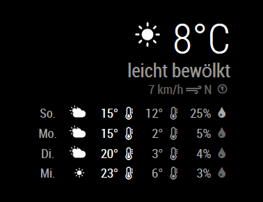

# MMM-RBB-Weather

[](https://travis-ci.com/nkl-kst/MMM-RBB-Weather)
[](https://coveralls.io/github/nkl-kst/MMM-RBB-Weather)
[](https://david-dm.org/nkl-kst/MMM-RBB-Weather)
[](https://david-dm.org/nkl-kst/MMM-RBB-Weather?type=dev)
[](https://snyk.io/test/github/nkl-kst/MMM-RBB-Weather?targetFile=package.json)
[](http://choosealicense.com/licenses/mit)

This is a module for the awesome [MagicMirror²](https://github.com/MichMich/MagicMirror/). It displays local weather data for cities in Berlin and Brandenburg (Germany) based on [RBB weather data](https://www.rbb24.de/wetter/wetterkarte/).



## Install the module

Go to modules folder
```
cd modules/
```

Clone this module from Github
```
git clone https://github.com/nkl-kst/MMM-RBB-Weather
```

Switch to newly created module folder
```
cd MMM-RBB-Weather/
```

Install dependencies
```
npm install --only=prod
```

After adding this module to your config (see below) restart your MagicMirror.

## Using the module

To use this module, add the following configuration block to the modules array in the `config/config.js` file:
```js
var config = {
    modules: [
        {
            module: 'MMM-RBB-Weather',
            position: "top_right", // All available positions
            config: {
                // See below for configurable options, this is optional
            }
        }
    ]
}
```

## Configuration options

All options are optional so the module works out of the box.

| Option                 | Description
|----------------------- |-----------
| `id`                   | City ID for data, see [table below](#city-ids)<br><br>**Type:** `String`<br>**Default:** `18228265` (Berlin)
| `days`                 | Days shown in forecast table. Set this to `0` to display only current weather. Data for seven days are available (including today), so `7` is the maximum here. <br><br>**Type:** `Number`<br>**Default:** `4`
| `animationSpeed`       | Duration of content refresh animation in seconds.<br><br>**Type:** `Number`<br>**Default:** `1`
| `updateInterval`       | Time between loading new weather data in seconds.<br><br>**Type:** `Number`<br>**Default:** `600` (10 minutes)
| `showCurrentWindspeed` | Flag to display current windspeed information.<br><br>**Type:** `Boolean`<br>**Default:** `true`
| `showRainProbability`  | Flag to display rain probability in forecast table.<br><br>**Type:** `Boolean`<br>**Default:** `true`
| `showWindspeed`        | Flag to display windspeed in forecast table.<br><br>**Type:** `Boolean`<br>**Default:** `false`
| `animateCurrentIcon`   | Flag to animate icon for current data.<br><br>**Type:** `Boolean`<br>**Default:** `true`
| `animateForecastIcon`  | Flag to animate icons in forecast table.<br><br>**Type:** `Boolean`<br>**Default:** `false`
| `tableClass`           | Classes added to forecast table. Could be used for additional styling, sizing etc.<br><br>**Type:** `String`<br>**Default:** `small`
| `whiteIcons`           | Flag to convert weather icons to simple white icons.<br><br>**Type:** `Boolean`<br>**Default:** `true`

## Problems

If you have any problems or questions, feel free to open an issue. There are many possible improvements for this module so please let me know if you miss something.

## Developer notes

To run all unit tests just fire this command in the module folder

```
# Install also dev dependencies
npm install

# Run tests
npm test
```

You can also check if RBB endpoints are available and still providing correct data

```
npm run test-int
```

## City IDs

Use one of these city IDs in your config.

| City                      | ID
|---------------------------|----------
| *Berlin*                  | <span/>
| Berlin                    | `18228265`
| Adlershof                 | `10385a`
| Alexanderplatz            | `10389`
| Frohnau                   | `10382a`
| Marzahn                   | `10385`
| Spandau                   | `10382`
| Steglitz                  | `10381`
| Tempelhof                 | `10384`
| *Brandenburg*             | <span/>
| Angermünde                | `18230230`
| Bad Belzig                | `18229487`
| Baruth/Mark               | `18230080`
| Beelitz                   | `18229472`
| Beeskow                   | `18229143`
| Bernau                    | `18228278`
| Brandenburg an der Havel  | `18228266`
| Brüssow                   | `18230250`
| Calau                     | `18229056`
| Cottbus                   | `18228271`
| Dahme/Mark                | `18230095`
| Döbern                    | `18229988`
| Eberswalde                | `18228294`
| Eisenhüttenstadt          | `18229162`
| Elsterwerda               | `18228547`
| Erkner                    | `18229163`
| Finsterwalde              | `18228558`
| Forst (Lausitz)           | `18230011`
| Frankfurt (Oder)          | `18228272`
| Fürstenberg/Havel         | `18228959`
| Fürstenwalde/Spree        | `18229182`
| Gransee                   | `18228963`
| Guben                     | `18230026`
| Halbe                     | `18228401`
| Herzberg (Elster)         | `18228577`
| Joachimstahl              | `18228313`
| Jüterbog                  | `18230130`
| Ketzin                    | `18228716`
| Kyritz                    | `18229352`
| Lauchhammer               | `18229094`
| Lenzen (Elbe)             | `18229847`
| Liebenwalde               | `18228997`
| Lieberose                 | `18228434`
| Lübben (Spreewald)        | `18228438`
| Luckau                    | `18228447`
| Luckenwalde               | `18230140`
| Ludwigsfelde              | `18230147`
| Meyenburg                 | `18229860`
| Nauen                     | `18228740`
| Neuruppin                 | `18229380`
| Oranienburg               | `18229023`
| Ortrand                   | `18229107`
| Perleberg                 | `18229869`
| Potsdam                   | `18228273`
| Prenzlau                  | `18230337`
| Pritzwalk                 | `18229917`
| Rathenow                  | `18228756`
| Rheinsberg                | `18229398`
| Rhinow                    | `18228761`
| Schönefeld                | `18228481`
| Schwedt/Oder              | `18230366`
| Seelow                    | `18228926`
| Senftenberg               | `18229131`
| Spremberg                 | `18230063`
| Strausberg                | `18228931`
| Templin                   | `18230375`
| Treuenbrietzen            | `18229671`
| Wittenberge               | `18229970`
| Wittstock/Dosse           | `18229432`
| Wriezen                   | `18228940`
| Ziesar                    | `18229718`


## License: MIT

See [LICENSE](LICENSE.txt)
